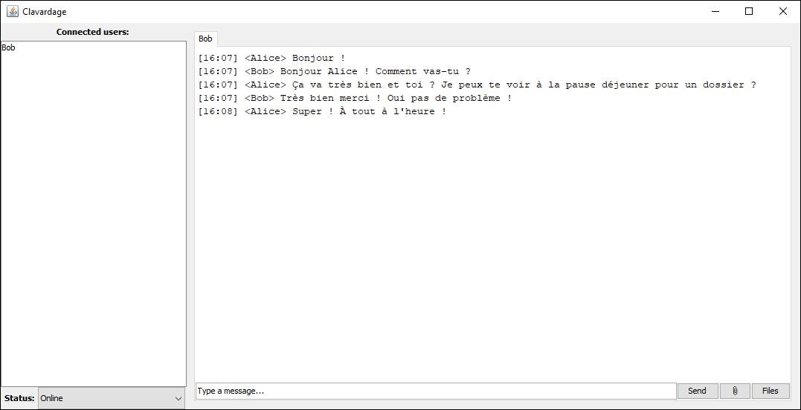

# Clavardage

## Manuel d'installation

### Installation du client
1. Récupérer le fichier **clavardage.jar**
2. Créer un fichier **client.config** dans le même dossier que le fichier clavardage.jar. Voir le fichier **client.config.example**, et un fichier valide permettant d'utiliser une base de données et un servlet hébergés en permanence a été envoyé par mail à M.~Yangui.
3. Executer **clavardage.jar**
4. Entrer un pseudonyme dans la fenêtre qui s'affiche et valider

La fenêtre principale devrait alors apparaître.

### Base de données
La structure de la base de données est disponible dans le fichier **database/clavardage.sql**. Ensuite vous devez définir un utilisateur qui puisse accéder à la base de données depuis un client distant.
```shell
MariaDB [(none)]> create user '<username>'@'%' identified by '<password>';
```
Et enfin vous devez donner les droits à cet utilisateur. Pour des raisons de simplicité, nous avons créé un utilisateur avec tous les droits mais cette pratique est à éviter.
```shell
MariaDB [(none)]> grant all privileges to '<username>'@'%' on <db_name>;
```
### Servlet
Le servlet est matérialisé par le fichier **clavardage.war**. Pour fonctionner, le servlet doit être mis sur un serveur **apache-tomcat**. La version utilisée pour ce projet est **tomcat9**. Sur la page de management de votre serveur (http://server.addr:8080/manage/html) vous pouvez déposer le **servlet.war** et le déployer. Une fois déployé le servlet sera accessible sur l'adresse http://server.addr:8080/servlet


